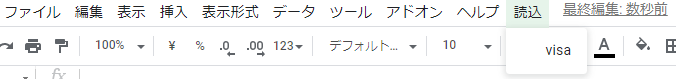
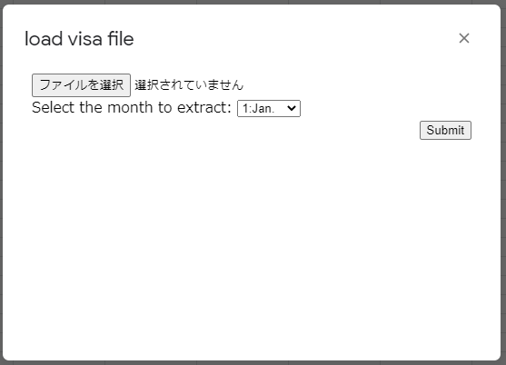

<h1 align="center">GAS Lib Load Amex File</h1>

<div align="center">
    <strong>The library for Google Apps Script that load amex csv file and pushback to spreadsheet.</strong>
</div>

<br/>

<div align="center">
    <sub>
        This library parses the SMBC card statement csv file and adds it to the spreadsheet.
    </sub>
</div>

<br/>

## How to use in Google Apps Script.
### Install

Script ID : 1zmRYdzeb2lIWei6nJJ8ETfo7ilTOFXRmfhryxTsSdKHVKt7uNdyET2lP

If you don't know how to use library, You look at this [link](https://developers.google.com/apps-script/guides/libraries).

### For example
You can load smbc card payment statement csv file downloading from (vpass)[https://www.smbc-card.com/mem/index.jsp].

The csv file is looks like this.
```csv
三井　住友　様,4980-1234-5678-9***,三井住友
2016/03/17,ショップ猫,3260,１,１,3260,
2016/04/01,ワンワン薬局,7200,１,１,3260,
```

And file encoding is <foct style="color:red;">"sjis".</font>

If you use this, you need something to do.

```javascript
// Add a menu to execute the function.
function onOpen()
{
	// The first argument is the name displayed in the menu bar.
	// The second argument is the name displayed in the menu item of the first argument.
	GASLibLoadAmexFile.addMenuToMenuBar("読込", "amex");
}

// Implement the callbackAmex function like this.
// This function call from Dialog, so be sure to implement with this function name and arguments.
function callbackAmex(formObject) {
	// The first argument specifies the argument of this function.
	// The second and subsequent arguments are individual settings.
	GASLibLoadAmexFile.callbackAmex(formObject, 8, 0, 1, 4, 7, 5, 6);
}
```

Then, the new item is added to the menu bar.



When you click the amex item, following dialog is opened.



Select your amex csv file and the month to extract.  
Then, push Submit button.  

If successful, <font style="color: blue">"Got it!"</font> Will be displayed.

## How to use in local with clasp and typescript.

### Install

Add to devDependencies code block in package.json

```json
	"devDependencies": {
		"@types/gas-lib-load-amex-file": "github:LiuToki/gas-libs#load-amex-file"
	}
```

Add to compilerOptions code block in tsconfig.json

```json
	"compilerOptions": {
		"types": ["gas-lib-load-amex-file"]
	}
```

### For example
main.ts
```typescript
import { GASLibLoadAmexFile } from "gas-lib-load-amex-file";

function onOpen()
{
	GASLibLoadAmexFile.addMenuToMenuBar("読込", "amex");
}

function callbackAmex(formObject) {
	GASLibLoadAmexFile.callbackAmex(formObject, 8, 0, 1, 4, 7, 5, 6);
}
```

To add the Amex item to a menu shared with other libraries, create the menu once and call `addToUi()` after adding every item.

```typescript
function onOpen()
{
	const ui = SpreadsheetApp.getUi();
	const menu = ui.createMenu("読込");
	GASLibLoadAmexFile.addItemToMenu(menu, "amex");
	menu.addToUi();
}
```

## [Function description](./docs/functions_description.md)

## Author
[LiuToki](https://github.com/LiuToki)

## License
[MIT](./LICENCE)
