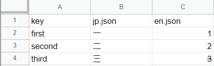

# GAS Library Language Json Maker.
The library for Google Apps Script that converts translated text written in a spreadsheet into a json file.

## How to use in Google Apps Script.

### Install

Script ID : 1AEVC7CZeJoGaU62g5GS3Z336H4XNNjvBggC1tZFiovIxyLpq64VRxsGD

If you don't know how to use library, You look at this [link](https://developers.google.com/apps-script/guides/libraries).

### For example

You make data like in following picture.



You can make json file easily. You don't need to special setting to use.

```javascript
let sheet = SpreadsheetApp.getActiveSheet();	// Translate data sheet.
let maker = GASLibLangJsonMaker.CreateCMakeLanguageJson(sheet, "forler id where file save");
maker.DoWork();
```

Following is explain that upper screenshot spreadsheet data.
- Culomn A  
Json key. A1 is not using for keys(explain this is key culomns).

- Culomns B to ...  
Json value. culomn B is japanese data and culomn C is english data.  
Row 1 is filename(include extension) that you want to output.

Then, this is what output is.

jp.json
```json
{"first":"一","second":"二","third":"三"}
```

en.json
```json
{"first":"1","second":"2","third":"3"}
```

## How to use in local with clasp and typescript.

### Install

Add to devDependencies code block in package.json

```json
	"devDependencies": {
		"@types/gas-lib-lang-json-maker": "github:LiuToki/gas-libs#lang-json-maker"
	}
```

Add to compilerOptions code block in tsconfig.json

```json
	"compilerOptions": {
		"types": ["gas-lib-lang-json-maker"]
	}
```

### For example

Use upper data.

main.ts
```typescript
import { GASLibLangJsonMaker } from "gas-lib-lang-json-maker";

function DoMakeJson() {
	let sheet: GoogleAppsScript.Spreadsheet.Sheet = SpreadsheetApp.getActiveSheet();
	let maker = GASLibLangJsonMaker.CreateCMakeLanguageJson(sheet, "forler id where file save");
	maker.DoWork();
}
```

# Author
[LiuToki](https://github.com/liutoki)

# Licence
[MIT](./LICENSE)
