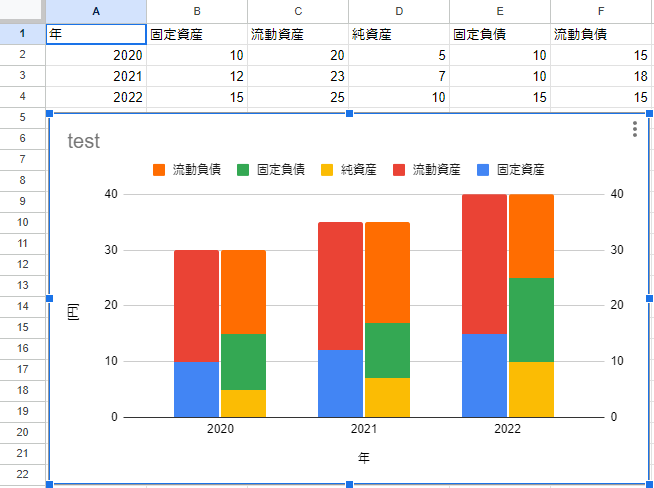

<h1 align="center">balance-sheet-graph</h1>

<div align="center">
    <strong>The library for Google Apps Script that create balance sheet graph.</strong>
</div>

<br/>

<div align="center">
    <sub>
        This library load data and create graph to the spreadsheet.
    </sub>
</div>

<br/>

## How to use in Google Apps Script.
### Install

Script ID : 1An07zzzsMVb5FHIH9-RpB9kctS7Ea1F9SPXTIN75dnsfbJFu0sOzfvS8

If you don't know how to use library, You look at this [link](https://developers.google.com/apps-script/guides/libraries).

### For example
This library can create stacked graph for year-to-year comparison of balance sheet contents.



By using the following items from the balance sheet, you can roughly compare year-to-year transitions.
Currect Assets, Intansible Assets, Current Liabilities, Long-Term Liabilities and Stockholder`s Equitys.

Sample Code:
```javascript
function bsGraph() {
  var sheet = SpreadsheetApp.getActiveSheet();
  var years = sheet.getRange("A1:A4");
  var currectAssets = sheet.getRange("B1:B4");
  var intansibleAssets = sheet.getRange("C1:C4");
  var currentLiabilities = sheet.getRange("D1:D4");
  var longTermLiabilities = sheet.getRange("E1:E4");
  var stockholdersEquitys = sheet.getRange("F1:F4");
  GASLibBalanceSheetGraph.createBalanceSheetGraph(years, currectAssets, intansibleAssets, currentLiabilities, longTermLiabilities, stockholdersEquitys, "test", "[円]", false);
}
```

## How to use in local with clasp and typescript.

### Install

Add to devDependencies code block in package.json

```json
	"devDependencies": {
		"@types/gas-lib-balance-sheet-graph": "github:LiuToki/gas-libs#balance-sheet-graph"
	}
```

Add to compilerOptions code block in tsconfig.json

```json
	"compilerOptions": {
		"types": ["gas-lib-balance-sheet-graph"]
	}
```

### For example
main.ts
```typescript
import { GASLibLoadVisaFile } from "gas-lib-load-visa-file";

function bsGraph() {
  var sheet = SpreadsheetApp.getActiveSheet();
  var years = sheet.getRange("A1:A4");
  var currectAssets = sheet.getRange("B1:B4");
  var intansibleAssets = sheet.getRange("C1:C4");
  var currentLiabilities = sheet.getRange("D1:D4");
  var longTermLiabilities = sheet.getRange("E1:E4");
  var stockholdersEquitys = sheet.getRange("F1:F4");
  GASLibBalanceSheetGraph.createBalanceSheetGraph(years, currectAssets, intansibleAssets, currentLiabilities, longTermLiabilities, stockholdersEquitys, "test", "[円]", false);
}
```

## [Function description](./docs/functions_description.md)

## Author
[LiuToki](https://github.com/LiuToki)

## License
[MIT](./LICENCE)
